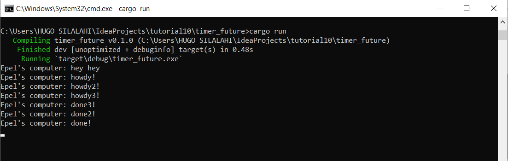

# Tutorial 10

### 1.2. Understanding how it works

Pada program kali ini, "Epel's computer: hey hey" di-print sebelum "Epel's computer: howdy!" dan "Epel's computer: done!". Ini terjadi karena `println!("Epel's computer: hey hey");` berada di luar `spawner.spawn` dan dijalankan sebelum `executor.run();`. Teks "Epel's computer: howdy!" dan "Epel's computer: done!" berada di dalam `spawner.spawn` dan baru akan di-print ketika `executor.run();` dijalankan, sehingga teks tersebut di-print setelah "Epel's computer: hey hey".

 

### 1.3. Multiple Spawn and removing drop

**Dengan `drop(spawner)`**

**Tanpa `drop(spawner)`**

Dari kedua gambar tersebut, dapat dilihat bahwa urutan print tulisan "done" berbeda-beda pada setiap run. Hal ini terjadi karena pengambil task oleh `executor` bisa berbeda-beda untuk setiap run.

Setiap kali `spawner.spawn` dipanggil, spawner akan membuat suatu task yang kemudian dikirim oleh `task_sender` kepada `executor`. Task yang dikirimkan kemudian membentuk suatu queue. Executor akan mengambil satu task dari queue tersebut untuk dijalankan dengan urutan bebas yang bisa berbeda dengan urutan spawn awal.

Pada gambar kedua, program dijalankan tanpa `drop(spawner)`. Program masih terus berjalan setelah semua task yang di-spawn sudah dijalankan dan program tidak berhenti secara otomatis seperti sebelumnya. Hal ini terjadi karena `drop(spawner)` digunakan untuk menutup/drop spawner setelah membuat task dan memberi tahu executor bahwa tidak ada lagi task yang harus dijalankan. Tanpa drop, executor tidak akan tahu bahwa semua task nya sudah selesai dan executor tetap terus berjalan.